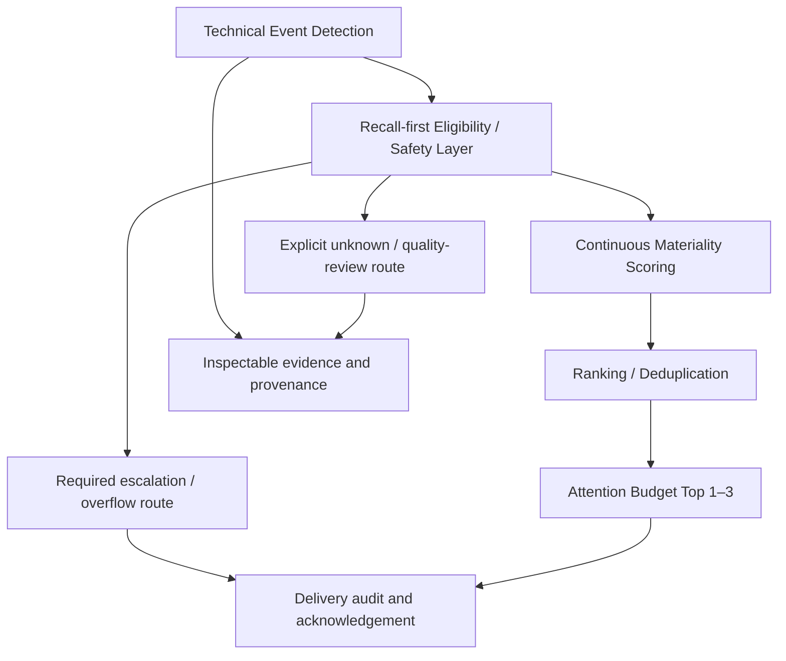

# Technical Materiality Architecture & Evaluation Review

Date: 2026-10-02. Governing experiment: `technical-v3-finalization-20261002`; completed development evaluation: `technical-v3-development-eval-v1-20261002`.

Scope: architecture and evaluation review only. V3 remains failed under its original contract. This document does not change a formula, threshold, label, selection rule, detector, or production behavior. Historical coefficients below describe already-frozen implementations, not proposed parameters.

## 1. Executive conclusion

**Recommendation C: retain A_T50 only as a temporary research/regression baseline while separating detection from ranking in the next research phase. Do not ship A_T50 unchanged as Technical V1 on this evidence.**

The strongest diagnosis is a combination of **decision-layer coupling, evaluation-contract demands, and event-specific semantic mismatch**. The existing score architecture contributes, but V3 does not show that continuous Materiality scoring has failed as an approach. All challengers substantially improve attention-scale error and overall ordering. They still fail the unchanged requirement to have no material misses and no loss of pair concordance in any defined event type. These are two independent failures; resolving one would not retroactively qualify a candidate.

A_T50 is admissible because the contract retains it as the reference. Its zero observed false negatives come with 90 false positives and 39.2% precision on this selected benchmark. That is not evidence of superior severity estimation or acceptable production attention burden. Conversely, better MAE does not authorize promoting a failed challenger.

The recommended direction is a **testable separation of responsibilities**, not an approved replacement engine: establish which factual events must remain available, which require a safety escalation, how severe they are, and which distinct episodes deserve scarce display slots. Keep factual evidence and uncertainty inspectable throughout. An upstream safety layer cannot guarantee recall merely by being introduced; it needs an independent denominator and an end-to-end delivery contract.

## 2. What V3 actually demonstrated

The 160 labels were frozen before scoring, with attention counts 31/71/35/23 for levels 0/1/2/3. There are 58 human-material and 102 non-material cases. The sample has 40 cases per event type, half evidence-stratified and half hash controls, across eight fresh tickers during 2020–2023. Input hashes, verbatim labels, threshold-family invariants, and resumability checks passed; 156 relevant tests passed in the completed evaluation. [E1, E2]

| Candidate | Event-macro MAE | Pooled pair concordance | FP | FN | Precision | Sensitivity |
|---|---:|---:|---:|---:|---:|---:|
| A_T50 | 0.333429 | 0.816353 | 90 | 0 | 0.391892 | 1.000000 |
| V2R_T50 | 0.116702 | 0.958417 | 3 | 8 | 0.943396 | 0.862069 |
| V2R_T45 | 0.116702 | 0.958417 | 4 | 2 | 0.933333 | 0.965517 |
| V2R_T40 | 0.116702 | 0.958417 | 15 | 1 | 0.791667 | 0.982759 |
| V2R_T35 | 0.116702 | 0.958417 | 28 | 1 | 0.670588 | 0.982759 |
| V3_N90 | 0.124826 | 0.948442 | 3 | 10 | 0.941176 | 0.827586 |
| V3_SF | 0.112106 | 0.955896 | 3 | 5 | 0.946429 | 0.913793 |

Macro and ordinary case MAE coincide here because the four event samples are equal-sized. V2_R improves MAE by 0.216727 versus A; V3_SF by 0.221323. Every challenger improves MAE in every event type. Pooled and event-macro concordance improve overall, despite the price-event regression. These are observations on this benchmark, not estimates of future population performance. [E1]

The threshold experiment isolates an important distinction: all four V2_R variants have identical continuous predictions, MAE, ordinal errors, and concordance. Their different confusion matrices arise solely from material-decision thresholds. Within the frozen set, lowering the threshold recovers some attention-2 events while increasing false positives. No threshold variant passes all gates. No additional operating point was examined. [E1, E2]

Earlier aggregate reports show that the same broad tension predates V3; they are contextual evidence, not pooled independent trials:

| Completed experiment | Aggregate evidence | Interpretation under its own contract |
|---|---|---|
| Calibration V1, 38 calibration cases | A macro MAE approximately 0.3234; D0 approximately 0.1011; FN 0 versus 1 | Improved score accuracy with a material miss; calibration was not deployment approval |
| Validation V1, 64 cases | A/D0 macro MAE 0.344329/0.115924; FP 38/2; FN 0/4 | D0 failed; some macro comparisons were incomplete because MA labels lacked diversity |
| Calibration V2, same 38-case calibration foundation | V2_R macro MAE 0.103073 and FN 1 | Its shortlist position came from the preregistered tie-break, not proof of superiority |
| Validation V2, 64 fresh cases | A/V2_R macro MAE 0.357820/0.113353; FP 34/0; FN 0/1 | V2_R failed the FN gate; undefined MA-class comparisons also limited conclusions |

Different cohorts, label mixtures, and acceptance contracts prevent treating these numbers as a single learning curve. Only aggregate prior-report evidence is used in this diagnosis; no closed validation individual is used for tuning. [E5–E8]

## 3. What V3 did NOT demonstrate

V3 did not establish production readiness for A or any challenger. It did not measure detector recall over all real-world material events: its denominator contains already-detected, sample-eligible events. An event absent from the detector output or excluded by sampling could not become a labeled miss in this experiment.

It did not test the proposed safety layer, live alert rates, deduplication, personalized ranking, or Attention Budget Top 1–3. The selected sample spans 144 distinct dates; 129 dates contain only one selected case and no date contains more than three. Those are incomplete samples of possible competing events, not real choice sets. Good pooled concordance cannot establish that the right event appears in a user's top three. [E3]

It did not establish a probability model. `attention/3` is a normalized ordinal-severity target; a score is not automatically `P(attention >= 2)`. Nor do MAE improvements establish that all adjacent attention levels have equal product cost. This equal-spacing assumption is part of the frozen metric, not an independently validated utility scale.

It did not resolve confidence or missing-data behavior: all 160 engine Confidence values are 1, sector/economic channels are absent, and the sample intentionally requires the evidence needed for its strata. V0 consistency was checked against the frozen scorer executed after label freeze; Phase 1 had no pre-existing V0 scores to reproduce. No confidence variation or hidden historical score record should be inferred. [E1–E3]

No challenger passed. There is no selected challenger to take into Final Validation, and this review does not reopen the closed search.

## 4. Continuous-score vs binary-decision analysis

These responsibilities need separate definitions and measurements:

| Responsibility | Question answered | What the current evidence measures |
|---|---|---|
| Factual event detection | Did a specified observable event occur? | Candidates emitted by deterministic detectors; not complete event-recall coverage |
| Recall protection | Was a potentially important event retained and, if required, delivered? | Threshold misses on sampled detected events only |
| Severity estimation | How much attention does this event deserve? | MAE against attention/3 and ordinal error |
| Event ordering | Which of two events should come first? | Unequal-attention pair concordance across sampled events |
| Binary material classification | Is this event above a defined decision boundary? | Candidate-specific threshold confusion and class-conditional rates |
| Attention Budget | Which distinct events should occupy limited slots now? | Not measured; requires contemporaneous context, deduplication, and a display policy |

The score is currently used for severity estimation, ordering, and a binary gate carrying a zero-miss requirement. Top 1–3 is an intended product role, not an implemented or validated extension of that gate. These goals are not mathematically impossible to satisfy together, but they have different error costs and denominators. The evidence shows the current construction and contract do not jointly satisfy them; it does not prove that no scalar representation could ever do so.

A clear example is V0's additive construction: `(S + N + C) / 3`. With C=1 and a state transition setting N=1, even S=0 produces 2/3. Thus a valid MA or RSI transition automatically clears 0.50 regardless of intrinsic magnitude. Confidence supplies an additive score contribution even though trustworthy evidence is not itself large economic change. This explains how the baseline can preserve sampled recall while assigning excessive attention to mechanically valid but weak events. [E9]

The frozen challengers improve this separation through event-specific significance and multiplicative Confidence, but a final-score threshold still decides whether an event is material. Novelty simultaneously affects continuous severity and passage through that threshold. That is a product-semantic choice, not a neutral numerical operation.

## 5. False-negative vs false-positive tradeoff

A flags 148 of the 160 sampled cases as material, including 90 of 102 human non-material cases. The high positive rate helps explain zero sampled FN; it does not establish an effective attention filter. These fractions cannot be converted into daily notification counts because the sample is stratified and spaced. [E1]

Stored-output decomposition locates the misses precisely without re-scoring or searching: [E3]

| Candidate | Volume FN | MA FN | RSI FN | Price FN | Total FN |
|---|---:|---:|---:|---:|---:|
| V2R_T50 | 2 | 0 | 1 | 5 | 8 |
| V2R_T45 | 2 | 0 | 0 | 0 | 2 |
| V2R_T40 | 1 | 0 | 0 | 0 | 1 |
| V2R_T35 | 1 | 0 | 0 | 0 | 1 |
| V3_N90 | 2 | 0 | 3 | 5 | 10 |
| V3_SF | 2 | 0 | 1 | 2 | 5 |

**All these misses are scored attention-2 events.** None is an unscored event, a suppressed event, or an observed detector omission. All 23 attention-3 cases clear their candidate's material threshold in this sample. Every challenger suppresses the same 18 volume cases, all human attention 0. This distinguishes a decision miss from eligibility suppression, without declaring attention-2 misses harmless.

Moving from the already-frozen T50 to T45 reduces FN from eight to two and increases FP from three to four; T40 reduces FN to one with 15 FP. T35 adds 13 further FP without reducing FN. These comparisons document the existing experiment only. They neither authorize a replacement threshold nor establish what an untested threshold would do.

The novelty hypotheses also did not resolve the failure. N90 has more misses and worse MAE than V2_R. Algebraically, its change from the canonical combination is proportional to `S_e - N`: reducing novelty's weight can lower a score when novelty exceeds significance. In particular, a state-transition N of 1 can support rather than discount an event. The significance floor leaves transition scores unchanged when canonical score already exceeds `C*S_e`; MA and RSI metrics are identical for V2_R and SF here. SF reduces some price misses but still fails. It would be incorrect to attribute all misses to novelty discounting. [E1, E9]

A recall-first retention/safety layer is therefore a sensible direction to investigate. It must not simply reuse the failed score gate under a new name, nor turn every retained event into a top-level alert. Retention, escalation, and display omission must remain distinguishable and measurable.

## 6. abnormal_price_move concordance analysis

### Observed degradation

The 40 price cases contain 581 unequal-attention pairs. The exact stored-score ordering is:

| Score family | Correct pairs | Incorrect pairs | Ties | Concordance | Price MAE |
|---|---:|---:|---:|---:|---:|
| A_T50 | 563 | 17 | 1 | 0.969880 | 0.237759 |
| V2_R, every threshold | 552 | 29 | 0 | 0.950086 | 0.142516 |
| V3_N90 | 551 | 30 | 0 | 0.948365 | 0.137786 |
| V3_SF | 549 | 32 | 0 | 0.944923 | 0.131694 |

For V2_R, 26 baseline-correct pairs become incorrect, 14 baseline-incorrect pairs become correct, and the one baseline tie becomes correct. The net loss is 11.5 pair credits, about 0.01979 in concordance. This is a real regression under the frozen strict per-event gate, despite substantially improved price MAE. The formula tie band of 0.02 is not permission to waive a concordance gate; it applies only after all hard gates pass. [E2, E3]

### Feature and semantic diagnosis

Among all 26 newly incorrect pairs, the higher-attention event has **larger absolute raw price movement and higher own-history abnormality, but smaller absolute excess return, lower market-relative abnormality, and lower mapped excess magnitude**. All have an attention gap of one. In none does the higher-attention case have lower novelty. Twenty-four pairs compare different tickers; twenty compare different years; none compares events on the same date. These are overlapping, descriptive associations, not a fitted attribution model or independent statistical trials. [E3]

This pattern matches a visible architectural choice. With the price channels present, A uses the available-channel mean of own-history O and market-relative M inside its significance. The frozen V2_R price branch inherits D0's `0.50*M + 0.25*O + 0.25*R`, where R is the existing saturated absolute-excess mapping. Thus a residual is represented both by a historical percentile and by an absolute magnitude mapping. These are two views of the same residual, not independent confirmations. Raw absolute price magnitude is available as evidence but is not a separate direct magnitude term in that price branch. No coefficients are being proposed or changed here. [E9]

The most strongly supported explanation is therefore **a mismatch between residual-focused score construction and a human target that also rewards total price movement and own-history abnormality**. This is not evidence that market-relative context is useless. It is evidence that “large movement deserving attention” and “unusual stock-relative movement” are not interchangeable semantics for one event label.

| Possible cause | Evidence-based assessment |
|---|---|
| Decision threshold | Not the cause of pair degradation: all four V2_R thresholds have identical orderings |
| Feature construction | Plausible contributor: percentiles depend on each stock's history; saturation compresses magnitudes; raw and residual magnitude are not equivalent |
| Market-relative treatment | Strongly supported contributor: all newly lost pairs favor the higher-residual event over the higher-own-history/raw-move event |
| Event semantics / target definition | Strongly supported tension: a single attention label must reconcile total movement and market attribution; independent rubric validation is missing |
| Monotonicity bug | Not supported: with fixed availability and Confidence, the existing mapping is non-decreasing in O, M, R and N. The lost pairs trade off inputs; none is featurewise dominated by the lower-attention case |
| Novelty alone | Insufficient explanation: no newly lost pair gives the higher-attention event lower novelty; N90 and SF do not restore concordance |
| Evaluation design | Amplifies the consequence: a strict no-regression gate on a small, correlated pair set can veto large aggregate improvements; its operational cost has not been established |

The market feature is an excess return versus VN30, not a causal estimate of company-specific news. The replay subtracts benchmark return without a stock-specific exposure model; historical volatility, sector exposure, index membership, and direction can influence interpretation. Ranking absolute residuals also removes directional alignment information from those particular channels. These are feature-definition limitations to investigate, not a request to introduce a new model or ticker-specific rule.

There is no proof that a future score needs different numeric weights. Neither a strict monotone rescaling of a single existing score nor a decision threshold can repair its pair ordering. Before changing construction, determine what should be ordered: total-move attention, attribution-specific attention, or contextual display priority. Preserve both observations in the evidence.

### Limits of this diagnosis

The 581 pairs are derived from 40 cases and share cases; they are not 581 independent observations. There is no uncertainty analysis establishing a population-level price-ranking deterioration. Nor does the absence of same-date lost pairs excuse the gate failure: it limits what this metric tells us about live Top 1–3 choices. Within the frozen V3 contract, the failure stands. No significance test, bootstrap, ablation, alternative score, or new threshold was run for this review.

## 7. Current architecture diagnosis

The repository already separates factual candidate objects, raw evidence, scoring context, and scoring functions. That is a useful foundation, not a reason for an opportunistic rewrite. The coupling occurs when experimental admission/scoring and one final threshold are treated as the end-to-end materiality decision. [E9]

Current behavior is approximately: historical data → deterministic analytics/context → event candidates and recurrence → V0 or offline candidate score/admission → material decision at a threshold. Ranking, delivery-oriented deduplication, personalization, and Attention Budget are not yet production-integrated according to CONTEXT.md.

Specific findings:

- **Broad event generation:** price events are emitted when return and own-history context are available; volume events are emitted when volume and its context are available. The detectors do not require those observations to be highly abnormal. Weak “abnormal”/“unusual” candidates are therefore expected. A detector candidate is not already a material insight, and source event types must remain unchanged.
- **State transition versus magnitude:** MA crossing and RSI entry are genuine transitions; validity alone does not make them high-severity events. V0 adds maximum novelty to both.
- **Recurrence is not episode deduplication:** EventMemory records the last occurrence for `(ticker, event_type)`, using past-only calendar-day distance. It is not a record of the last delivered alert, direction-specific novelty, or a shared economic episode across event types. All 40 sampled price events repeat within five calendar days; 33 repeat after one day. This makes event opportunity frequency influential in novelty without measuring user attention already consumed.
- **Support has event-specific meaning:** V2_R correctly does not use a same-day price jump to manufacture volume magnitude, and its MA branch excludes a direct market-price boost. Yet volume labels can also value price confirmation. Whether support changes intrinsic volume severity or only display priority needs an explicit rubric. V2_R's “R” change is in RSI support; the price and volume branches retain inherited behavior.
- **Quality is not severity:** unknown adjustment semantics and modeled EOD availability coexist with Confidence=1 in this benchmark. Confidence variation and missing-evidence routing have not been validated. Missing sector/economic values must remain null; source trust cannot be inferred from a large score.
- **Reference admissibility is not deployment acceptance:** preserving a baseline under a failed challenger experiment does not establish that the baseline meets a separately specified product burden or safety contract.

## 8. Candidate future architecture options

These are conceptual alternatives for architecture review, not new scoring candidates.

| Option | Benefit | Principal limitation | Evidence status |
|---|---|---|---|
| Keep one scalar and one global material gate | Simple operational interface | Continues conflating severity, recall and display; frozen variants did not satisfy joint demands | No support for shipping it as-is |
| Separate recall retention/safety from continuous severity and budgeted ranking | Can preserve evidence access while reducing prominence of weak events; misses can be localized to stages | Needs explicit safety routing, capacity handling, and stage-specific labels; moving a threshold upstream alone solves nothing | Recommended direction to investigate |
| Keep distinct evidence facets such as total movement and market attribution through ranking | Preserves disagreements and makes event semantics inspectable | Requires rules for contextual priority and comprehensible explanations; not yet validated | Compatible with the separation above, not an approved new formula |

Compact conceptual architecture:

“Eligibility” must distinguish evidence validity, retention for consideration, and mandatory escalation. A low ranking score must not silently delete an event retained for safety. The escalation route makes a capacity conflict visible rather than falsely claiming that a Top 1–3 panel can contain every required event. This diagram is a proposal for responsibilities, not implemented behavior.

## 9. Recommended architecture direction

Make continuous severity and contextual ranking the main research direction for Materiality, with separately accountable recall/delivery constraints. Keep a binary status only where it names a concrete operational action—retained, needs review, requires escalation, or qualifies for a particular surface—and define the owner and cost of that decision. Do not make one universal “material/not material” bit stand for every stage.

Recall protection belongs primarily to candidate retention and required-event delivery, rather than an undifferentiated threshold on final display priority. Intrinsic importance should not disappear merely because the user already saw a related episode or another event outranks it. Novelty, preferences and duplicate handling may affect presentation while the factual evidence and event severity remain inspectable. This is a domain hypothesis for future specification, not a retroactive revision of V3 labels or formulas.

An upstream pass is insufficient if downstream ranking drops the event. A safety claim must cover detection → retention → deduplication → display/escalation, with explicit handling of unknowns and competing events. A fixed-capacity Top 1–3 surface cannot display all important events when demand exceeds capacity; the product must decide how an overflow is retained, communicated and audited before claiming zero misses.

Reuse existing schemas, providers, deterministic calculations and provenance. Keep ticker support dynamic. No ticker-specific rules, new numeric weights, threshold search, machine-learning addition, or production implementation is proposed in this task.

## 10. Evaluation-contract implications

### Where does material FN = 0 belong?

| Use | Assessment for a future contract |
|---|---|
| V3 development gate | Binding and correctly failed. Do not reinterpret or waive it |
| Future development acceptance | Useful as a declared regression check on a defined must-retain set, but alone can reward over-triggering. Pair it with burden, scope, uncertainty and end-to-end delivery measurements before data is unblinded |
| Production safety invariant | A finite sample cannot prove zero future misses of latent human materiality. Make testable process invariants—no silent loss of recognized required events—and separately estimate recall, unknown rates and drift against independently observed events |
| Detector requirement | Recall-focused acceptance is appropriate, but needs material events labeled independently of detector output, including negatives, non-emitted events and outages |
| Continuous ranking requirement | A binary miss at a global threshold is not the same as bad ranking. Evaluate order, severity error and safety exposure separately; attach a zero-loss process requirement to designated required events, not to every rank position |

Before any future implementation, pre-register which denominator each measure covers. Detection recall must include events that were never emitted. Retention and deduplication recall must account for losses after detection. Severity evaluation can retain ordinal and continuous metrics with a justified target scale. Binary action metrics require a declared action and error cost. Attention Budget evaluation requires full contemporaneous candidate sets, shared-episode labels, and contextual priority judgments. Ranking metrics may include precision/relevance at the actual display budget, priority-order agreement and missed required events; their definitions and acceptance criteria must be approved in advance, without proposing numeric cutoffs here.

Retain event-level breakdowns and pooled/macro distinctions. In V3, all four aggregate event metrics are defined, but MA has only one material case among 40; mathematical definition is not adequate statistical support. Its 39 unequal-label pairs share that one material example. RSI has no attention-0 example. Defined-only subset metrics must disclose denominators; undefined values remain undefined. [E1]

The strict per-event concordance gate protects against sacrificing one domain for an average improvement. It is not inherently erroneous. However, its business meaning, estimation uncertainty and relationship to current-task ranking need to be specified prospectively. No-regression across multiple correlated metrics is a demanding conjunction, not evidence that the reference is best on every goal. This review does not relax the V3 gate.

## 11. Risks and unresolved questions

| Risk or question | Evidence needed before adopting a redesign |
|---|---|
| Which omissions are safety-critical? | Explicit user/product definition separating retainability, attention severity, urgent delivery and acceptable deferment |
| Can total-move and stock-relative attention share one label? | Independent blinded judgments on raw/own-history versus market-relative disagreements, with a clarified rubric and disagreement records |
| Are detector misses hidden? | An event inventory labeled independently of the existing detector, including non-emitted windows and unavailable-data periods |
| Does ranking reduce burden without hiding important events? | Complete same-time choice sets and user task context; observed review load, missed required events, redundant slots and escalation delivery |
| Does recurrence represent repeated information? | Episode and prior-exposure annotation across price, volume, MA and RSI; preserve raw event identities even when presentation is grouped |
| Can Confidence affect safety responsibly? | Trustworthy examples of stale, missing, inconsistent or revised evidence; coverage and abstention tests, not fabricated lower Confidence values |
| Do labels generalize? | Independent reviewers or a documented adjudication protocol, task consistency and ordinal/pairwise agreement. Human-confirmed labels remain authoritative here; template-like notes or agreement on a second pass do not establish inter-rater reliability |
| Are improvements stable outside this sample? | Fresh, authorized prospective research evidence and uncertainty at the ticker/date/episode level; do not treat correlated pairs as independent trials |
| Does live data differ from historical replay? | Current-membership survivorship, adjustment/corporate-action handling, missing benchmark pairs, EOD availability assumptions and vendor revisions audited explicitly |

The benchmark's spacing and evidence strata are useful for coverage but remove much of the real competition, recurrence and prevalence needed for attention-budget evaluation. Its hash controls are controls within a detector-conditioned, constrained pool, not a random sample of a user's daily experience. A second pass on selected labels is not evidence that a new safety interpretation was independently labeled. These limitations support clearer research design; they do not authorize relabeling V3.

## 12. Concrete next research/evaluation step

**Next step: approve an architecture and evaluation charter separating detection/retention, severity, and delivery priority before designing another numerical experiment.** Do not initiate another parameter cycle disguised as an architecture review.

The charter should define the user decision and error costs; distinguish observed event validity, market attribution, retainability and urgency; specify when a required event may be grouped or deferred; and define handling of unavailable evidence and attention-budget overflow. It should also document which existing evidence schemas can carry those distinctions without changing historical facts.

Then design, for separate authorization, a blinded observational study of complete event episodes and contemporaneous candidate sets. Include independently identified potentially missed events and channel-disagreement scenarios. Collect distinct judgments of retention need, severity, contextual ordering and duplication; adjudicate disagreement and preserve provenance. This is a proposed semantic/evaluation study, not a scoring candidate, Final Validation, or a request to reuse closed validation individuals. No cases or labels are generated by this review.

Adoption would require evidence that these responsibilities can be labeled reliably, that an independently assessed retention/delivery path protects required events, and that budgeted presentation improves usefulness under realistic load. Only after that charter is approved should stakeholders decide whether any implementation research is justified under a new explicit authorization. The closed V3 experiment, its failed gates and its no-V4/V5 stopping rule remain unchanged.

### Evidence and reproducibility

- **E1:** [Completed V3 development report](C:/Users/PC/Downloads/vn30-intelligence-agent/data/evaluation/development_evaluations/technical-v3-development-eval-v1-20261002/REPORT.md), including full metrics, label distributions, sensitivity summaries and limitations.
- **E2:** [Frozen V3 specification](C:/Users/PC/Downloads/vn30-intelligence-agent/data/evaluation/development_freezes/technical-v3-finalization-20261002/specification.md), [experiment manifest](C:/Users/PC/Downloads/vn30-intelligence-agent/data/evaluation/development_freezes/technical-v3-finalization-20261002/experiment_manifest.json), [case manifest](C:/Users/PC/Downloads/vn30-intelligence-agent/data/evaluation/development_freezes/technical-v3-finalization-20261002/case_manifest.json), and [mechanical decision](C:/Users/PC/Downloads/vn30-intelligence-agent/data/evaluation/development_evaluations/technical-v3-development-eval-v1-20261002/decision/decision.json).
- **E3:** [Descriptive decomposition of stored V3 outputs](C:/Users/PC/Downloads/vn30-intelligence-agent/data/evaluation/architecture_reviews/technical-v3-20261002/stored_output_analysis.json), produced by [analysis script](C:/Users/PC/Downloads/vn30-intelligence-agent/data/evaluation/architecture_reviews/technical-v3-20261002/analyze_stored_outputs.py). It enumerates existing pair outcomes and groups existing misses; it imports no candidate engine, computes no new candidate scores and searches no thresholds.
- **E4:** [V3 per-event metrics](C:/Users/PC/Downloads/vn30-intelligence-agent/data/evaluation/development_evaluations/technical-v3-development-eval-v1-20261002/metrics/per_event_metrics.json) and [fixed-prediction diagnostics](C:/Users/PC/Downloads/vn30-intelligence-agent/data/evaluation/development_evaluations/technical-v3-development-eval-v1-20261002/diagnostics/leave_one_ticker_out.json). These are existing outputs, not rerun optimization.
- **E5:** [Calibration V1 aggregate report](C:/Users/PC/Downloads/vn30-intelligence-agent/data/evaluation/calibration_comparisons/frozen12-20260929/report.md).
- **E6:** [Validation V1 aggregate report](C:/Users/PC/Downloads/vn30-intelligence-agent/data/evaluation/validation_evaluations/validation-v1-20260929-eval-v1/report.md). The review uses completed aggregate outcomes, not individual validation cases for tuning.
- **E7:** [Calibration V2 aggregate report](C:/Users/PC/Downloads/vn30-intelligence-agent/data/evaluation/calibration_comparisons/technical-v2-20260930/report.md).
- **E8:** [Validation V2 aggregate report](C:/Users/PC/Downloads/vn30-intelligence-agent/data/evaluation/validation_evaluations/validation-v2-20260930-eval-v1/report.md). Its undefined comparisons and failed FN gate are retained as reported.
- **E9:** [Domain contract](C:/Users/PC/Downloads/vn30-intelligence-agent/CONTEXT.md), [detectors](C:/Users/PC/Downloads/vn30-intelligence-agent/src/materiality/detectors.py), [V0 scoring](C:/Users/PC/Downloads/vn30-intelligence-agent/src/materiality/scoring.py), [scoring service](C:/Users/PC/Downloads/vn30-intelligence-agent/src/materiality/service.py), [historical context](C:/Users/PC/Downloads/vn30-intelligence-agent/src/evaluation/context.py), [EventMemory](C:/Users/PC/Downloads/vn30-intelligence-agent/src/evaluation/event_memory.py), [canonical calibration source](C:/Users/PC/Downloads/vn30-intelligence-agent/data/evaluation/development_freezes/technical-v3-finalization-20261002/canonical_code/src/evaluation/calibration.py), [canonical V2 source](C:/Users/PC/Downloads/vn30-intelligence-agent/data/evaluation/development_freezes/technical-v3-finalization-20261002/canonical_code/src/evaluation/calibration_v2.py), and [V3 evaluation adapter](C:/Users/PC/Downloads/vn30-intelligence-agent/src/evaluation/development_v3_evaluation.py).

Input hashes and phase status are persisted in [review provenance](C:/Users/PC/Downloads/vn30-intelligence-agent/data/evaluation/architecture_reviews/technical-v3-20261002/input_hashes.json) and [review status](C:/Users/PC/Downloads/vn30-intelligence-agent/data/evaluation/architecture_reviews/technical-v3-20261002/status.json). Frozen V3 experiment SHA-256: `ca7cbfa66731ea8ecfce6748ecca338a27da77845197e804deefdc11a9258012`; case manifest SHA-256: `0384f84c9e48118d44567420ebea0893dfb7ca42b71165162505ee58a8b18ba8`.

No candidate formulas, thresholds, human labels, sampling, production code, or original evaluation artifacts were changed. No V4/V5 was created; no optimization, Final Validation, frontend tests/build, or 2025–2026 holdout access occurred. Validation V1/V2 individuals were not used for tuning.

**Final disposition: C. Keep A_T50 only as a temporary baseline while separating detection from ranking in the next research phase.** A is not supported for unchanged Technical V1 shipment; the failed challengers are not approved replacements. The evidence supports investigating separated responsibilities, while adoption and implementation remain contingent on a prospective semantic and evaluation contract.
