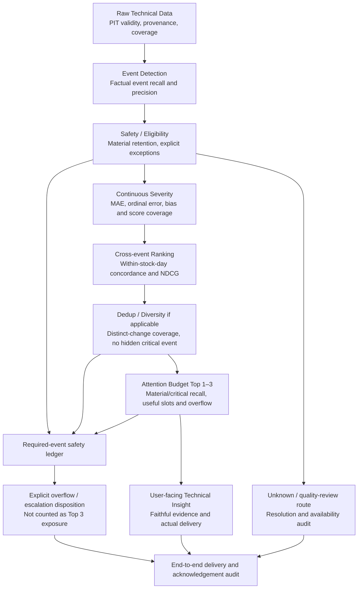

# Technical Materiality Evaluation Contract V2

Date: 2026-10-02. Status: **research design; benchmark/annotation readiness incomplete**. This is an evaluation contract, not a new scoring candidate or permission to deploy. Normative terms **must** and **must not** apply to a future explicitly authorized study.

The product question is: **“Given a stock the user is monitoring, what changed today that deserves attention?”** Detection, retention/safety, severity, ordering, and display are different responsibilities. No scalar may silently replace all five decisions.

Primary basis: [Architecture Review](C:/Users/PC/Downloads/vn30-intelligence-agent/docs/TECHNICAL_MATERIALITY_ARCHITECTURE_REVIEW.md). V3's failed outcome remains binding: all challengers improved severity MAE and false-positive burden, but none passed the frozen gates. All its false negatives were already-detected, scored attention-2 events. Its 26 newly inverted price pairs showed a raw/own-history versus market-relative preference conflict. None of this establishes live Top 1–3 usefulness or approves a replacement for A_T50.

## 1. Evaluation units and grouping

**Primary ranking group: one monitored stock, one trading date, one declared decision cutoff.** The initial research scope is the existing end-of-day technical workflow. Group identity includes ticker, exchange session/date, cutoff and timezone, available-data snapshot, and the declared user task. A group must contain the complete eligible candidate set at that cutoff, not selected historical examples assembled after labeling.

| Unit | Definition | Responsibility evaluated |
|---|---|---|
| Event-level unit | One immutable technical candidate with event type, direction, observation time, available_at, source, evidence and recurrence | Detection match, eligibility disposition, severity |
| Stock-day unit | The complete opportunity inventory and all emitted technical candidates for one stock/session, including days with none | Coverage, missed detection, exclusions, operating burden |
| Ranking group | The eligible candidates for that stock-day/cutoff, with the same monitoring task and prior-exposure context | Conditional ordering among genuine competitors |
| Insight unit | A coherent change represented by one or more source events, with an explicit event-to-insight mapping | Deduplication, evidence fidelity and coverage of distinct changes |
| Attention-Budget output | The ordered, actually displayed list of up to three insight units, plus separately recorded safety/overflow dispositions | User exposure, omission, redundancy, relevance and burden |

Rolling stock history supplies context: prior signals, regime state, existing episode, and what the user has already seen. It is **not** a rolling pool of old events competing again with today's new events by default. An ongoing episode enters today's group only through a newly observable update defined before evaluation; the source event and episode links remain intact. Unresolved earlier safety items have a separately audited pending/escalation lifecycle rather than being silently reclassified as new events.

Cross-stock/watchlist ranking, intraday refresh and portfolio personalization are outside the initial contract. They require different choice sets and separate authorization; do not infer them from pooled historical metrics. Future multiple cutoffs must be distinct evaluation groups with shared-session dependence disclosed, not extra independent examples.

Three populations must remain explicit:

- **Reference inventory:** independently adjudicated event opportunities for the stock-day, including events the system did not emit and data that cannot be adjudicated.
- **Conditional ranking population:** emitted, retained candidates with enough evidence to be ranked; omissions before this boundary are reported separately.
- **End-to-end reference insights:** distinct, human-adjudicated changes that should have been available for today's product task, regardless of whether detection or eligibility preserved them.

Report both conditional and end-to-end results. A good ranking of survivors cannot hide events lost upstream.

## 2. Event Detection contract

### Responsibility and interfaces

The detector answers **“Did a declared transition or abnormal condition occur?”** It does not answer how much attention the event deserves.

Inputs are PIT-valid OHLCV/technical observations, prior state, trailing context, the benchmark information available at cutoff, and quality/provenance. Output is an immutable candidate or an explicit no-event/unknown disposition for a declared opportunity. Include predicate/version, observation and availability times, direction, raw evidence, and reasons. A severity score is not required for detection.

Every event family must have a versioned, predeclared factual predicate and opportunity population, separate from any severity or display threshold. Matching is one-to-one on stock, event family, direction/state where relevant, and session/cutoff. No post-result timing tolerance or cross-type substitution is allowed. Repeated emissions for one reference event count as duplicate outputs, not extra true positives.

| Event type | Factual semantics and current limitation |
|---|---|
| ma_cross | Existing MA20/MA50 ordering changes between consecutive valid technical observations. Direction and previous/current averages establish the transition; a tiny spread can still be a valid detection |
| rsi_regime_entry | Existing entry across the upper/lower RSI boundaries, with previous/current values. Existing 70/30 rules describe the current detector; staying within a regime is not a new entry |
| abnormal_price_move | Record the observed raw return and history/market context. The current detector emits broadly when return and own-history context exist; its name does not certify a materially abnormal move |
| unusual_volume | Record observed volume and available trailing context. The current detector emits broadly when volume/context exist; below-normal volume is not evidence that the observation never occurred |

For price and volume, a future benchmark must distinguish **broad observation-candidate coverage** from recognition of a specifically defined abnormal condition. An abnormal-condition existence rubric/predicate must be signed off and frozen before that accuracy claim is evaluated. This document supplies no new numeric abnormality cutoff and changes no existing detector. Until the condition is operationalized, report candidate-generation coverage; do not advertise anomaly precision or derive ground truth from attention labels.

### Misses and denominators

A **detector FN** is an ascertainable, in-scope reference event available by the decision cutoff with no correctly matched emitted candidate. This requires an inventory created independently of detector output. Missing data or unknown truth is an explicit unresolved opportunity, not a fabricated positive or negative. Report unresolved counts and potentially important cases blocked by data separately from measurable detector FN.

An emitted event later excluded, scored low, ranked low, deduplicated incorrectly, or omitted from display is **not** a detector FN. It is attributed to the later stage. A valid transition labeled attention 0 or 1 is not automatically a detector FP.

Required measures:

- Event recall: matched reference positives / all ascertainable reference positives, per event type and coverage slice. No positives means undefined.
- Event precision: correctly matched outputs / adjudicated emitted outputs, including invalid or duplicate emissions in the denominator. No outputs means undefined. Emitted outputs need independent existence adjudication; attention reject labels are insufficient.
- False-positive rate or specificity only where a predeclared, meaningful negative opportunity population exists. Do not invent true negatives by enumerating arbitrary timestamps.
- Coverage: eligible stock-days processed / intended stock-days; event-family availability and reference coverage; number of emitted candidates and duplicate emissions per stock-day.
- Unknown opportunity rate, missing required-input rate, data-quality exclusion counts/reasons, and late recognition relative to the frozen cutoff. The detector has no severity “unscored” status; report missing detection evidence here and scoring availability downstream.

## 3. Safety / Eligibility contract

The layer answers **“Can this candidate be safely retained for consideration, or does it need a visible exception route?”** It does not rank events and must not silently use the final severity threshold as its admission rule.

Every emitted candidate receives a logged disposition with a reason and provenance:

| Disposition | Permitted meaning | Required handling |
|---|---|---|
| Retained for ranking | Supported, in-scope event with adequate usable evidence | Preserve identity and evidence; low estimated severity alone is not an undocumented removal reason |
| Retained but unresolved | Event/evidence uncertainty prevents a reliable next step | Keep explicit unknown status, route for quality review or declared fallback, and track unresolved duration; never fabricate a score |
| Excluded as invalid/out of scope | Demonstrated invalid evidence, fixture contamination, unsupported scope or a predeclared non-event condition | Preserve the audit record and count exclusions; a material reference case lost here is an eligibility failure regardless of the reason code |
| Linked duplicate | Same source event or adjudicated duplicate representation | Retain a traceable link to the surviving representation; count genuine information loss as failure, not dedup success |

Data-quality flags inform reliability and exception routing; they do not prove low importance. Low or unavailable Confidence must not be translated automatically into “not material.” Contradictory or unavailable evidence may prevent ordinary ranking, but it requires an explicit unresolved route rather than silent dismissal. Historical raw values and nulls remain unchanged.

**Safety-relevant human target:** use intrinsic event attention `a >= 2` as the initial research target for retention, with attention 3 reported separately. This reuses the meaning of existing labels without claiming that they already label urgency or a mandatory notification deadline. A separate human judgment must specify required escalation, deadline/context and whether an unresolved route is adequate. Legacy attention >=2 is not automatically “must occupy a Top 3 slot.”

The future zero-FN aspiration belongs to **retention plus required delivery**, not a severity-score threshold. It has three distinct statuses:

- **Hard process invariant:** every emitted event has a traceable disposition; no recognized required event disappears through exclusion, grouping, null handling or budget truncation; a required escalation is audited through delivery/acknowledgement under the predeclared service contract. This can be tested on system behavior, not on unknowable future labels.
- **Research target:** zero observed wrongful removal of adjudicated attention>=2 cases, separately zero critical removals, on a defined benchmark. Before scoring, the study must decide whether any observed miss blocks that phase. Finite samples cannot guarantee zero future FN. Retaining everything also cannot demonstrate usefulness.
- **Monitoring metrics:** material retention recall, critical retention recall, unsafe exclusion count, unresolved-material count, conditional passage volume, unresolved-age distribution, and required-delivery misses in the assessed reference population.

Report strict **rankable retention recall** and **accounted-for retention coverage** separately. The former counts material cases ready for ranking; the latter may include a legitimate, tracked exception route. Routing every material event to “unknown” cannot pass a rankable-coverage or timely-delivery requirement. Unknowns remain in the safety audit denominator rather than being converted to true negatives. Quantify exclusion/abstention burden and investigate every observed loss; do not grant automatic pass from an improved average.

For conditional eligibility metrics, the denominator is all emitted, independently adjudicated attention>=2 events entering the layer; the critical denominator uses attention=3. The rankable numerator includes only those retained as rankable, and the accounted-for numerator includes those rankable or explicitly retained on a valid unresolved route. An exclusion log alone does not count as retained coverage. Denominator zero means undefined. Separately report end-to-end retention against **all** material reference events, including detector misses; retain stage attribution so that this broader measure does not rename detector loss as eligibility loss. An event whose human severity itself is unknown is counted in the annotation-unknown population, not assigned a material class. Report required-delivery recall against the independently labeled set of delivery obligations, not against whatever the system happened to flag.

These definitions are prospective. V3's original FN=0 gate and failed disposition remain unchanged.

## 4. Continuous Severity contract

Severity answers **“How much attention does this event deserve?”** It is an event-level, evidence-grounded estimate under a fixed rubric, not a classifier, probability of future return, investment recommendation, or guarantee of display.

Keep intrinsic attention `a` in `{0,1,2,3}` and use `y=a/3` as the reference normalized target for comparability. Equal spacing is an explicit evaluation convention, not proof that human utility is linear. No new scoring formula is defined here. The rubric must distinguish event magnitude/abnormality from novelty, prior exposure and task-specific ordering; existing labels remain immutable.

Historical attention judgments sometimes already incorporated recurrence or supporting signals. They remain authoritative **under their original rubric** and can serve as legacy severity/retention proxies; this contract does not claim they have been factorized into pure intrinsic severity and contextual priority. New fields need new, separately versioned judgments on future authorized data rather than a silent reinterpretation or relabeling of V1–V3.

Required metrics on scoreable, labeled events:

| Metric | Definition and reporting |
|---|---|
| Per-event MAE | Mean absolute error between severity and `a/3`, separately for the four event types |
| Event-macro MAE | Equal-weight mean of defined per-type MAEs; primary severity metric, with defined-type count and sample sizes |
| Overall MAE | Case-weighted mean absolute error; disclose case mixture and compare on the same reference population |
| Ordinal error | Absolute attention-level error and confusion matrix using the existing diagnostic boundaries 1/6, 1/2, 5/6, unless a separately approved contract later changes the diagnostic definition |
| Calibration by attention | Count, mean score, spread and signed error for each actual attention level, overall and by type; optional score-bin reliability plots require bins fixed before evaluation |
| Bias and tails | Signed error `score-y`, over/under-scoring frequency, ordinal errors of multiple levels, and attention-2/3 underestimation |
| Availability | Scoreable/unknown counts and rates by attention, type, data quality and safety disposition |

A missing score stays null. MAE/ordinal error is undefined for an empty scoreable subset. The primary observed-score result must be paired with coverage; systems cannot gain acceptance by withholding hard cases. Also report matched-case comparisons when systems have different score coverage. Coverage acceptance must be frozen before results are inspected.

**Compatibility with old evaluation:** V1–V3's `mae` field used a common-denominator convention: suppression utility zero and unknown penalty one. Their scoreable-only MAE was separate. Preserve these historic results and, where needed, report a clearly named **legacy penalized utility MAE** alongside new observed-score severity MAE. Never mix them in one comparison or rename a null factual score to zero. Eligibility suppression belongs to eligibility evaluation; it is not a newly defined severity value. This distinction matters before any proposed model comparison.

No fixed binary material threshold is required at this layer. The inherited ordinal midpoints are diagnostic cut points, not eligibility, safety or display rules. A downstream binary action, if needed, requires its own named decision contract and prospective evaluation.

## 5. Ranking contract

Ranking answers **“Among the eligible events for this stock today, which deserves attention first?”** It must produce an ordered list and explicit ties/unknowns without altering severity or raw facts.

### Relevance, populations and ties

Use a separate group-context relevance label `r(i,g)` in `{0,1,2,3}`: no useful change for today's task, low priority, material priority, critical priority. It is judged with the complete candidate set, prior exposure and task context. It may differ from intrinsic severity `a(i)`; for example an already-explained severe episode may add little new information today. A required safety disposition still applies. Existing isolated attention labels must not be silently copied into this contextual field.

The initial contract uses **linear gain equal to contextual relevance** for ranking metrics. This is a declared evaluation convention using the supplied ordinal scale, not a new event-scoring formula or fitted weight. It avoids assuming an unvalidated exponential utility premium. Rank discount is the conventional `1/log2(position+1)` for NDCG. Any later alternative gain convention requires prior specification, not result-driven selection.

Compute event-level ranking metrics before deduplication on the complete conditional group; compute product metrics after deduplication on independently annotated insight units in Section 6. Report same-type and cross-type pair results only within legitimate groups. Historical all-date pooled pair concordance remains a severity-order diagnostic and cannot be presented as within-day ranking performance.

Human relevance ties impose no required order; omit them from pair-concordance denominators. A model tie across unequal human relevance receives half a concordance credit. Future implementations must declare deterministic, label-independent tie-breaking before evaluation. For rank-cutoff metrics, report actual deterministic-order values and tie-neutral expected values averaged over permutations within tied score blocks. These are expectations over a specified tie set, not random reruns or best-case tie choices. Display metrics always use the order actually shown. Report the fraction of groups affected by a cutoff tie.

### Exact metric definitions

For a complete group with `n` candidates and cutoff `k` in `{1,3}`, use positions through `min(k,n)`; there are no fabricated candidates. Let `L_k` be the actual first `k` positions returned. A missing position contributes no delivered gain, while unavailable factual evidence remains null.

- **Pair concordance:** correct-order credits plus half credits for model ties, divided by the number of unequal-relevance pairs with comparable model outputs in the same group. Zero comparable pairs means undefined. Report comparable-pair coverage against all reference unequal-relevance pairs; unknown model outputs must not vanish from coverage reporting.
- **DCG@k:** sum `r(i,g)/log2(j+1)` for the candidate actually placed at each displayed/returned position `j <= k`.
- **IDCG@k:** the same discounted sum for the best human-relevance order of the **full reference group**, not just returned items. **NDCG@k = DCG@k / IDCG@k**; if ideal gain is zero, NDCG is undefined. Unknown rank outputs reduce returned gain on an otherwise fully labeled group; an incomplete reference-label set cannot define a full-group ideal.
- **Contextual Recall@1 and Recall@3:** number of reference candidates with `r>=2` in `L_k`, divided by all reference candidates with `r>=2`. No contextual-material candidates means undefined. These differ from intrinsic-material recall based on `a>=2`.
- **Relevant-event coverage within Top 3:** report Contextual Recall@3 and the fraction of positive groups in which all contextual-material candidates are present. Break out groups in which full coverage is possible (`relevant count <= min(3,n)`) from capacity-exceeding groups.
- **Top-1 best relevance hit:** whether the first output belongs to the human maximum-relevance set, for groups whose maximum relevance is positive. Any human-tied maximum is correct; no output is a miss on such a group. An all-zero group has no useful “best” event and is excluded from this hit-rate denominator.

### Boundary cases and aggregation

| Group condition | Required metric behavior |
|---|---|
| Fewer than three candidates | Use the available positions; no padding with assumed negatives. Ideal gain comes from all available candidates |
| One candidate, positive relevance | Pair concordance undefined. NDCG is 1 if returned in first position and 0 if omitted. Contextual recall is defined only if r>=2. Report separately as a noncompetitive group |
| All candidates have equal positive relevance | Pair concordance undefined; NDCG still evaluates returned gain. This group offers no evidence of relative ordering quality |
| No contextual-material candidates but some r=1 | Contextual recall undefined; NDCG can be defined. A perfect NDCG here does not prove useful material selection |
| All contextual relevance zero | IDCG=0, NDCG and contextual recall undefined; report unnecessary exposure via budget metrics |
| Empty group | Pair/NDCG/recall undefined; evaluate whether the system correctly produced an empty state |
| Missing relevance annotation or unresolved reference inventory | Mark group incomplete; do not fabricate labels, an ideal ordering or full-group ranking metrics. Report completeness and reasons |

Primary ranking summaries are equal-weight means over defined groups, with denominators. Also report competitive groups separately (`n>=2` with unequal relevance), group-size slices and per-ticker/period results. Pair-pooled results are secondary because larger groups otherwise dominate. Uncertainty assessment must respect ticker/day/episode dependence; do not count every pair as an independent trial. Never replace an undefined metric by zero or one merely for aggregation.

## 6. Attention Budget contract

This layer evaluates **actual user exposure**, not an offline threshold classification. The product allows up to three useful technical insights for the monitored stock-day. “Top 1–3” is not an instruction to fill slots with noise: zero is a valid no-useful-change or explicit unavailable-data state. Distinguish those two states. An empty list on a day with important reference changes is still an omission.

### Deduplication and ground-truth insight units

Annotators must identify distinct changes/episodes and redundant representations without viewing candidate rankings. Freeze the reference event-to-insight grouping before evaluation. A displayed insight must preserve constituent event IDs and communicate the relevant change/evidence; a hidden link or arbitrary bundle does not count as covering every attached event.

Count distinct reference insight units once for product relevance/recall. A duplicate display of the same reference change cannot earn gain or coverage twice; an extra redundant slot has zero additional gain **by definition of novelty of exposure**, not because missing data was assigned zero. Report duplicate-slot rate and over-merging of genuinely distinct material changes. Maintain an event-coverage audit alongside insight coverage so deduplication cannot conceal a critical constituent.

Reference insight contextual relevance is independently annotated. For safety counting, an insight is intrinsically material if it contains a human attention>=2 event, and critical if it contains an attention-3 event. This is a target-membership rule, not an algorithm for predicting an insight score. Ambiguous episode boundaries remain documented/adjudicated; the model cannot alter the reference grouping to improve its metrics.

### Product measures

Let `J_g` be the full independently adjudicated end-to-end reference insight set for the task; it includes valid changes lost upstream. Let `D_3` be distinct, faithfully communicated reference insights covered by the actual first three display slots. Let `m` be the number of filled slots, at most three. Unmatched false insights are adjudicated irrelevant and count against precision/burden; unresolved adjudication makes the relevant group incomplete.

| Measure | Definition and interpretation |
|---|---|
| Top-1 best-insight hit | First displayed insight has maximum positive contextual relevance in J_g, allowing human ties; absent output is a miss when a useful reference insight exists |
| Attention-3 Recall@3 | Critical reference insights in D_3 / all critical reference insights. Undefined if none. Also report critical source-event coverage and groups with any critical omission |
| Material Recall@3 | Intrinsically material reference insights in D_3 / all material reference insights (attention>=2 membership). Undefined if none |
| Precision@3, filled-slot convention | Number of filled first-three slots providing a distinct material reference insight / m. Undefined when m=0. Repeated coverage gets no extra positive credit. Do not divide by three when only one or two slots were filled |
| NDCG@3 | Contextual insight gains at actual positions, normalized by the ideal order of the full J_g; duplicates add no gain and zero ideal gain remains undefined |
| Wasted-slot rate | Filled slots with contextual relevance<=1, false insight or redundant coverage / m; count each slot at most once. Undefined when m=0. Separately count slots containing only intrinsic attention 0/1 events |
| Attention-weighted missed relevance | Sum of contextual ordinal relevance of reference insights not faithfully covered in D_3, divided by the total contextual relevance in J_g; undefined if total relevance=0. Report the unnormalized missed-gain sum and critical/material omission counts alongside it |
| No-material-day burden | Share of stock-days with no material reference insight that display any insight; number of low-attention slots on those days. No such stock-days means the rate is undefined |
| Capacity and delivery audit | Filled-slot count; empty-output rate; material/critical demand exceeding capacity; required events retained, escalated, delivered and acknowledged under the frozen policy |

These definitions distinguish “material” (intrinsic attention), “relevant now” (contextual priority), and “required delivery” (separately annotated obligation). Report disagreements rather than collapsing them. Do not add precision, recall and NDCG into an unspecified composite product score.

If there are more than three distinct material changes, full Material Recall@3 is impossible. Record capacity pressure, actual recall, and the capacity ceiling `min(3,M)/M` for M material insights. On days where full coverage is feasible, report the fraction of groups that cover all material insights. Do not normalize away losses or claim 100% recall simply because the output used all slots. The same distinction applies when critical demand exceeds capacity.

The main display stays capped at three. Required events omitted from it must retain an explicit, auditable overflow/escalation disposition under the future product policy. A safety queue is not “shown in Top 3”; distinguish retention from delivery. Delivery timing, acknowledgement and visibility must be defined before a benchmark can test that route. No new UI or escalation behavior is implemented here.

## 7. Dedicated abnormal_price_move evaluation

The 26 V3 inversions motivate a semantic test, not a new weight search. Higher-attention events in those pairs had larger raw moves and own-history abnormality but weaker market-relative/excess magnitude. None of those pairs shared a date, so they do not by themselves demonstrate a wrong within-stock-day Top 1 choice.

Future annotations must retain: signed and absolute raw return; own-history distribution context; signed excess return versus the declared benchmark; market-relative abnormality; data quality; prior exposure; human intrinsic attention; contextual priority; and whether attribution is market-aligned, stock-relative, mixed or unresolved. Excess return is an observable comparison, not proof of company-specific causation.

| Diagnostic slice or check | Question it can answer |
|---|---|
| Raw/own-history ordering agrees with residual ordering versus disagrees | Does the target favor total movement or relative movement when the channels disagree? Preserve the sign of each pairwise difference |
| Larger raw movement with market-aligned context; modest raw movement with stronger residual context | Do annotators distinguish economic magnitude from market attribution? Human rubric judgments define these qualitative categories; numeric bin boundaries, if needed, must be frozen in a later authorized study |
| Up/down raw return crossed with up/down excess return, including sign disagreement | Is absolute residual magnitude being interpreted as directional corroboration when it is not? |
| Comparable evidence availability and Confidence, with featurewise dominance | Does a declared monotonicity property hold when other relevant inputs are held fixed? Channel tradeoffs are not automatically monotonicity bugs |
| Missing benchmark, short history, saturation/ties and different historical volatility contexts | Is ordering affected by missingness, historical scaling or compressed feature information? |
| Same-type severity pairs versus within-stock-day cross-event competitors | Is the error about severity semantics or the downstream ordering task? Current single daily price-event generation may leave no same-type competitors within a group |
| New episode versus repeat/already-explained episode | Is lower display priority due to prior exposure rather than lower intrinsic severity? |
| Annotator disagreement on total-move versus attribution importance | Is the human target ambiguous before any model comparison? |

Use pair flips, attention-gap counts, signed severity error, within-group rank losses and stage-of-loss attribution as diagnostics. Record rubric disagreement and uncertainty. Controlled synthetic/metamorphic tests may later test a declared monotonicity law, but must not invent physically incoherent evidence or be mistaken for real-world accuracy. No universal monotonicity in raw return is imposed while market context changes at the same time. No diagnostic slice creates an event-specific threshold or changes a V3 label.

## 8. Cross-event comparability

**Yes: scores presented as the same continuous severity quantity must share a common attention interpretation across volume, MA, RSI and price.** Otherwise a numeric severity comparison would be misleading. Event-specific feature construction may differ; the human severity scale and its rubric must not.

Ranking additionally requires comparable contextual priorities before events compete for scarce slots. If raw model outputs are not on a common severity scale, they must be explicitly named internal features, not advertised as comparable Materiality scores. A separately specified calibration/ranking boundary would then be needed; this contract neither defines nor fits that transformation. Do not silently normalize scores within a day: a day containing only weak events must not acquire an apparently critical maximum.

Assess cross-event comparability with per-event signed bias and MAE by human attention level, overlapping score distributions for equal attention, same-group cross-event concordance against contextual labels, type-specific exposure/miss rates, and mixtures of competing event families. Measure both pre-dedup ranks and final distinct-insight results. A type should not monopolize display because of a scale offset; low exposure is not automatically unfair if human relevance supports it. Type quotas or forced diversity are not specified.

The same OHLCV change may produce correlated price, volume and RSI evidence. Multiple signals are not automatically independent confidence or multiple useful insights. Cross-event calibration and duplicate coverage are distinct evaluation responsibilities.

## 9. Dataset and annotation requirements

Existing artifacts are immutable. The audit below uses their documented schemas and aggregate reports, not a new computation on protected validation individuals.

| Layer | Reusable evidence | What it cannot establish | Additional annotation needed |
|---|---|---|---|
| Detection | Raw evidence, event IDs, predicate code, provenance and replay tests; event-validity notes where explicitly available | Recall against events never emitted; anomaly precision for broad observation generators; no-event opportunities | Detector-independent stock-day inventory with existence labels, reference predicates, negatives, unknown opportunities and match identities |
| Safety | Existing attention>=2/3 labels as retrospective retainability proxies; stored exclusions and scoring statuses | Required escalation, timing, adequacy of exception handling, upstream losses or real missing-data prevalence | Retain/invalid/unknown judgments, required-delivery labels, exclusion reasons, deadline/context and observed route outcomes |
| Severity | Existing event attention 0–3 and evidence support historical MAE/ordinal diagnostics | Full confidence behavior, prevalence, robust missingness handling, independently validated utility spacing | Clarified intrinsic-severity rubric, adjudicated ambiguity and real quality/unknown cases in future authorized data |
| Ranking | Existing global pair diagnostics identify semantic concerns | Legitimate same-stock-day choice sets, contextual priorities, prior exposure, duplicate episodes | Complete group membership, contextual relevance, acceptable tied orders, episode links and prior-exposure state |
| Attention Budget | Existing raw provenance and display-independent labels inform design | Actual Top 1–3 relevance, omissions, wasted slots, dedup errors, overflow or no-useful-change behavior | Gold insight units and source-event coverage, full reference groups including omissions, expected empty states, required-route obligations and actual display logs |

Historical calibration had 46 labels split into 38 calibration and 8 stress cases; the calibration experiments used the 38, with stress reported separately. V1 and V2 validation had 64 cases each; V3 development had 160. These are not interchangeable training pools. Closed validation remains closed for tuning, and V3's labels cannot be rewritten to fit the new semantics.

V3 had 40 cases per type, but MA attention was 39 at level 1 and only one at level 2; RSI had no level-0 case. All engine Confidence values were 1. Evidence-stratified/hash-control sampling and same-ticker spacing do not reconstruct everyday competition. The architecture review found 144 dates for 160 selected cases, with 129 singleton dates; same-date coincidence across different tickers is still not the product's stock-day ranking group.

### Required future annotation package — no cases sampled now

For each independently chosen stock-day/cutoff, collect all eligible observations and reference opportunities, all system-emitted candidates, and an explicitly audited completeness statement. Annotate factual existence/unknown separately from intrinsic severity, contextual relevance, retainability, required delivery, and duplicate/episode membership. Annotate no-event and no-useful-insight days, single-event days, competing multi-event days, high-demand days and genuine data gaps. Preserve both raw and market-relative evidence, with independent judgment on their disagreement.

Annotators must be blinded to model identities, scores, rankings and thresholds. They may see only evidence available at the declared cutoff and the task/prior-exposure context needed for the judgment. Record reviewer IDs/version, uncertainty, independent judgments and adjudication; uncertainty is not engine Confidence. Freeze raw judgments and reconciled labels separately. Do not force agreement or convert unknown labels to attention zero.

A single event-level `HumanReview` currently records verdict, attention, note and provenance/version. It does not encode the complete group, contextual relevance, episode equivalence or required delivery. New annotations would therefore need a separate, versioned sidecar contract linked to immutable events; this is a design requirement, not a schema migration implemented here.

## 10. Point-in-time and leakage contract

A future benchmark is invalid unless all applicable checks pass before model comparison:

1. **Scope and availability:** freeze stock universe provenance, trading calendar, timezone, cutoff and observation versus available_at semantics. Current membership is not historical membership. An EOD availability assumption must be labeled as an assumption, not treated as an audited publication timestamp.
2. **Trailing context:** retain the established 252 prior-session reference window and minimum 60 history observations for reused empirical context, excluding the current observation. Indicators may include the current bar only if it is available by cutoff. Changes to this methodology require a new approved specification, not silent fallback.
3. **Benchmark alignment:** both benchmark observations needed for the return must be available by cutoff under the declared methodology. Missing benchmark/excess context remains null; no future fill or backdated correction.
4. **EventMemory and user exposure:** chronological, past-only updates; lookup before recording the current event. Event recurrence and prior user exposure are separate histories. No later alert, acknowledgement or episode outcome may alter an earlier state.
5. **Data quality/vintage:** preserve fixture flags, source and adjustment semantics; quarantine invalid records with reasons. Freeze source version and revisions policy; hash inputs. Do not silently substitute zeros or mix adjusted/unadjusted histories.
6. **Labeling boundary:** show annotators the same cutoff-valid evidence packet. No future price path, fundamentals, news or hindsight episode resolution may define the current relevance label. Other domains remain out of scope unless separately authorized with publication-time evidence.
7. **Group and episode integrity:** inventory completeness, stable IDs, no cross-split duplicated event or repeated episode used as fresh evidence. Cutoff/group construction must not depend on model results. Previous split observations may supply genuinely prior warmup, but labels/results may not be used as features or tuning feedback.
8. **Determinism and isolation:** fixed manifests, reproducible group order and matching rules, candidate/source hashes, immutable labels and output separation. Truncation/prefix checks must show that adding later data does not change earlier features, events, scores or groups. Any model-dependent processing must honor the same availability rule.
9. **Protected scope:** enforce an explicit input allowlist; no accidental loading of validation labels during development or of holdout observations during research. No benchmark can be considered valid solely because its final metrics look plausible.

Failed checks produce a blocked/invalid benchmark, not a model pass or fail. Save an auditable reason and repair only under the applicable predeclared data-correction procedure; preserve original artifacts.

## 11. Development / validation / holdout lifecycle

This is a prospective lifecycle for a separately authorized architecture study, not an automatic continuation of the stopped V3 search:

**Architecture specification → Development benchmark → Candidate freeze → Fresh validation → Final architecture freeze → Holdout.**

| Phase | Required freeze or control | Permitted changes / exit condition |
|---|---|---|
| Architecture specification | Layer duties, event semantics, units, rubric, PIT rules, metric/null/tie/matching definitions, baseline, research budget and stopping rule | Resolve design and annotation questions before implementation. Approve provisional gate magnitudes before any validation is exposed |
| Development benchmark | Independent inventory, complete groups, labels, quality audit, provenance and partition policy | Study semantics and develop only within an explicitly authorized scope. Any future allowed parameter work must be declared there; this document authorizes none. Version changes and keep an untouched selection assessment as specified |
| Candidate freeze | At most the prospectively authorized architecture/candidate set, including detection, eligibility, severity, rank/tie logic, grouping, dedup, display and exception policy; code/data/config hashes | All behavior affecting evaluation and all pass/fail criteria fixed. Missing gate definitions block the freeze. No result-driven rule filling |
| Fresh validation | Disjoint, complete groups/episodes from authorized fresh data; labels blinded and frozen before scores | Validation inaccessible for tuning from designation onward; once results open, it is closed evaluation evidence. A failure triggers the predeclared stop/review, not adjustment against its cases |
| Final architecture freeze | A passing architecture, exact behavior and evaluation report, with all components locked | Validation pass plus required safety/data/product checks; no unassessed changes between this freeze and holdout |
| Holdout | Explicit authorization after successful fresh validation and final architecture freeze; sealed access log and immutable inputs | One assessment of the frozen system under the approved protocol; never a development source or an opportunity to tune after seeing outcomes |

Partition at stock-day/group and episode level, not random event rows. Define ticker/time separation, warmup handling and recurring-episode leakage controls prospectively. Adjacent information must not cross partitions as supposedly independent examples. Separate real missing-data/operating-distribution evidence from deliberately enriched hard-case slices; report their results separately or use only a prospectively justified sampling correction.

The existing 2025–2026 holdout stays sealed. Existing Validation V1/V2 and completed V3 outcomes remain immutable, closed evidence under their original contracts. No Final Validation is run or sampled here. Any new research requires explicit authorization; this contract does not create V4/V5 or override the prior stopping rule.

## 12. Pass / fail structure by layer

Gate classifications: **E** = evidence-supported convention or measurement; **P** = provisional criterion requiring prospective justification/calibration; **S** = safety/integrity invariant; **R** = product requirement. Evidence for a metric definition does not automatically support a numerical acceptance threshold.

| Layer | Primary objective | Primary metric | Safety gate | Secondary metrics | Gate classification / status |
|---|---|---|---|---|---|
| Detection | Recognize factual in-scope events | Per-type event recall on independent inventory | No leaked/invalid reference evidence; explicit unknown and exclusion accounting | Event precision, coverage, duplicate rate, unavailable-input rate | PIT/accounting S; factual matching E; recall/precision acceptance levels P, not set |
| Safety / Eligibility | Preserve material events and required delivery | Material and critical rankable-retention recall | No silent disappearance; traceable exception/overflow route; required-delivery accounting | Unsafe exclusions, unresolved material, passage and review burden | No silent loss S; attention>=2 retention target E as a research starting point; observed zero-removal acceptance P until approved; delivery policy R |
| Severity | Estimate intrinsic attention | Event-macro observed-score MAE with explicit coverage | Critical underestimation/unknowns reviewed; no missing-as-zero; no silent survivor-only pass | Overall/per-type MAE, ordinal error, attention-level bias, legacy utility metric | Target/diagnostic conventions E; null/provenance S; acceptable error and coverage margins P |
| Ranking | Order true competitors in the stock-day | Group-macro NDCG@1 and NDCG@3 on complete groups, competitive groups separately | Required events remain accounted for; reference/tie definitions immutable | Within-group pair concordance, contextual Recall@1/@3, top-1 hit, cross-event bias | Grouping/task R; null and tie handling S; linear-gain convention P; acceptance levels P |
| Attention Budget | Deliver useful distinct insights within actual capacity | End-to-end Material Recall@3 and NDCG@3, alongside critical omissions | No unaudited loss of required/critical events through grouping or overflow; explicit failure path | Attention-3 Recall@3, filled-slot Precision@3, wasted/duplicate slots, missed relevance, no-material-day burden | Up-to-three capacity R; empty-state/overflow behavior R pending operational sign-off; traceability S; utility/burden acceptance P |

The labels 0–3, attention>=2 research target, and existing ordinal diagnostic boundaries come from prior contracts; they are not new model thresholds. The product's one-to-three attention budget motivates k=1 and k=3. Linear NDCG gain is a prospective evaluation convention requiring rubric approval, not a proven human utility law.

No new numeric MAE margin, recall tolerance, concordance tolerance, relevance cutoff for display, uncertainty interval, latency deadline, or FP cap is selected here. Those unresolved magnitudes cannot silently default to the old V3 .03/.05/strict-concordance rules or to an invented value. A future study must freeze justified gates and an analysis/uncertainty plan before validation. An unspecified required gate means **not ready/inconclusive**, not pass.

Integrity violations fail the affected benchmark/process. Required safety-invariant violations block progression and need investigation. Each performance layer receives its own pass/fail/inconclusive result against its prospectively frozen criteria. Overall research acceptance requires all mandatory layer decisions and product gates; a strong MAE cannot waive a delivery loss, and zero observed FN cannot waive unusable exposure burden. No label-dependent tie-break may be introduced after evaluation.

## 13. Baseline role and consistency with V1–V3

**A_T50 remains a temporary research baseline.** V3 did not establish it as a superior severity model. Its 0 FN came with 90 FP and macro MAE 0.333429; V2_R's macro MAE was 0.116702, but its frozen variants failed. Baseline admissibility must not automatically become Technical V1 production logic.

For future assessment, reuse the unchanged baseline only at seams it actually implements: event severity and its named legacy material decision. A has no proven safety workflow, dedup policy or Top 1–3 behavior. A future ranking/display baseline needs a separately frozen wrapper and must be identified as such; this task creates no wrapper or production behavior.

Consistency review against the Architecture Review, frozen V3 specification, current schemas and metric definitions:

| Existing definition/evidence | Contract V2 treatment |
|---|---|
| V3 failed under FN=0 and strict per-event concordance | Outcome and gates preserved; future layered criteria do not retroactively qualify any candidate |
| All V3 FN were scored attention-2 events | Call them later decision misses, never detector or suppression misses |
| Legacy attention/3, fixed ordinal bins, model pair ties worth half | Preserve as explicit compatibility conventions; contextual labels/group metrics are new requirements, not silently backfilled |
| Legacy penalized MAE, suppression utility 0, unknown penalty 1 | Preserve archived values and names; separate from observed-score severity MAE and safety accounting |
| Undefined metrics when no positive class or unequal pair exists | Preserve nulls, publish denominators; do not fabricate class members or averaging values |
| Frozen historical sample spacing and event strata | Useful for event coverage; insufficient evidence of complete product choice sets |
| Existing EventMemory uses past events, not delivered alerts | Preserve it; require separate exposure context for a future product evaluation |
| Confidence=1 and unavailable sector/economic context | Do not claim calibrated confidence or invent missing context |
| V0/V2 scores do not represent material-event probability | Keep severity, binary actions and ranking roles explicitly distinct |

Design consistency checks cover the following expected outcomes: no-positive recall is undefined; all-zero ideal gain makes NDCG undefined; a single positive item has no pair metric but receives perfect NDCG when returned; omitting that item gives zero delivered-gain NDCG without inventing a factual score; fewer than three filled slots use the filled-slot precision denominator; and capacity-limited recall below one is still reported when material demand exceeds three. These are metric-definition checks, not evaluation of real cases or a new implementation.

Source references:

- [Architecture Review](C:/Users/PC/Downloads/vn30-intelligence-agent/docs/TECHNICAL_MATERIALITY_ARCHITECTURE_REVIEW.md) and [domain vocabulary](C:/Users/PC/Downloads/vn30-intelligence-agent/CONTEXT.md).
- [Completed V3 report](C:/Users/PC/Downloads/vn30-intelligence-agent/data/evaluation/development_evaluations/technical-v3-development-eval-v1-20261002/REPORT.md), [frozen V3 specification](C:/Users/PC/Downloads/vn30-intelligence-agent/data/evaluation/development_freezes/technical-v3-finalization-20261002/specification.md), [experiment manifest](C:/Users/PC/Downloads/vn30-intelligence-agent/data/evaluation/development_freezes/technical-v3-finalization-20261002/experiment_manifest.json), and [label-freeze metadata](C:/Users/PC/Downloads/vn30-intelligence-agent/data/evaluation/development_evaluations/technical-v3-development-eval-v1-20261002/labels/label_freeze.json).
- [Existing evaluation metrics](C:/Users/PC/Downloads/vn30-intelligence-agent/src/evaluation/calibration.py), [V3 metric/selection adapter](C:/Users/PC/Downloads/vn30-intelligence-agent/src/evaluation/development_v3_evaluation.py), and [ReplayCase/HumanReview schemas](C:/Users/PC/Downloads/vn30-intelligence-agent/src/evaluation/models.py).
- [Current detectors](C:/Users/PC/Downloads/vn30-intelligence-agent/src/materiality/detectors.py), [scoring](C:/Users/PC/Downloads/vn30-intelligence-agent/src/materiality/scoring.py), [replay](C:/Users/PC/Downloads/vn30-intelligence-agent/src/evaluation/replay.py), [context construction](C:/Users/PC/Downloads/vn30-intelligence-agent/src/evaluation/context.py), and [EventMemory](C:/Users/PC/Downloads/vn30-intelligence-agent/src/evaluation/event_memory.py).

## 14. Architecture and evaluation responsibilities

Diversity is optional and must not impose unapproved event-type quotas. Deduplication must preserve meaning and traceability. The diagram defines evaluation boundaries only; it does not implement a route, new event type, score, UI, or API.

## 15. Evaluation Contract V2 — Research Readiness Decision

**B. Additional benchmark/annotation design is required before prototype implementation.**

The layer responsibilities and primary stock-day grouping are sufficiently specified to design that benchmark; a further unconstrained architecture debate is not the immediate blocker. Existing evidence can support severity diagnostics and regression references, but not acceptance of the proposed end-to-end system.

The exact missing capability is a **PIT-complete, independently annotated monitored-stock-day choice-set benchmark** containing:

1. An opportunity inventory independent of the current detector, including non-emitted events, negatives and unknown data, so detector recall has a valid denominator.
2. All competitors at the same cutoff and the relevant prior-exposure context, with separate intrinsic severity and contextual relevance/tie judgments.
3. Retention and required-delivery judgments, including what counts as a valid exception or escalation and its timing/acknowledgement contract.
4. Human-adjudicated event-to-insight/episode mappings, faithful-coverage rules, no-useful-change days, and demand beyond three distinct material insights.
5. Quality/missingness and reviewer-disagreement coverage, plus predeclared grouping, split, uncertainty, matching and stage-specific acceptance procedures.

Before prototype work, complete the annotation handbook and benchmark specification: operationalize price/volume existence semantics; sign off empty-output and overflow behavior; define unresolved-case handling; establish label agreement/adjudication; and freeze the future study's gate definitions and change budget. Specify what observations and labels are needed, without selecting exact cases or opening protected data. Provisional numerical acceptance values must be justified in the authorized research process and frozen before validation; they are not supplied here merely to fill a table.

No implementation, new scoring formula, weight choice, threshold search, V4/V5, relabeling, production/API/UI change, Final Validation, or 2025–2026 holdout access occurred. No candidate optimization was run against closed V1/V2 or completed V3 evidence. The task stops at this design document.
